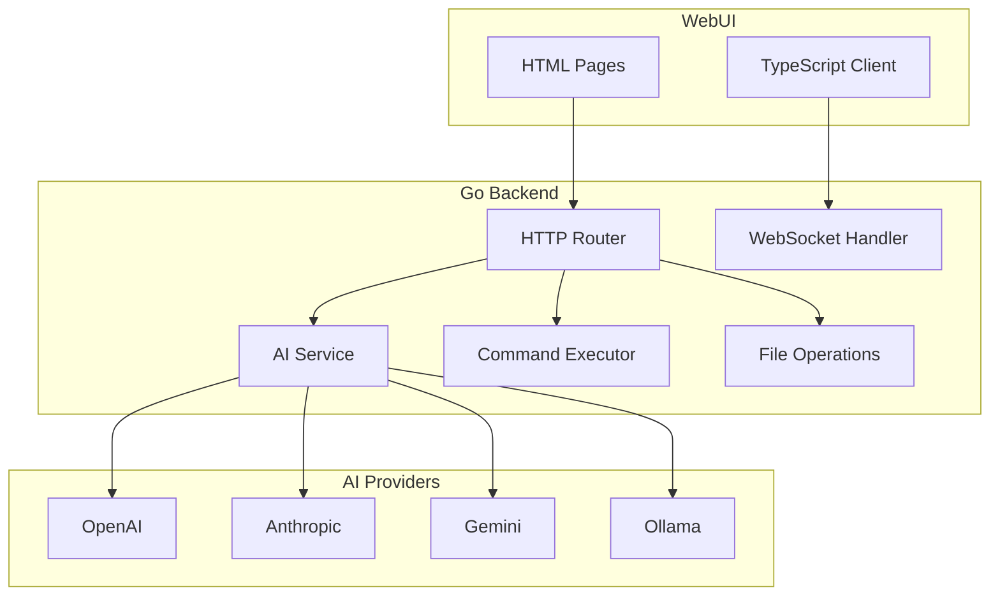

# PiBot - AI-Driven Raspberry Pi Assistant

## Architecture Overview



## Project Structure

```
pibot/
├── cmd/
│   └── pibot/
│       └── main.go              # Application entry point
├── internal/
│   ├── ai/
│   │   ├── provider.go          # Unified AI provider interface
│   │   ├── openai.go            # OpenAI implementation
│   │   ├── anthropic.go         # Anthropic implementation
│   │   ├── google.go            # Google Gemini implementation
│   │   └── ollama.go            # Ollama implementation
│   ├── executor/
│   │   ├── executor.go          # Command execution with sandboxing
│   │   └── sandbox.go           # Command validation and confirmation
│   ├── fileops/
│   │   └── fileops.go           # File read/write operations
│   ├── config/
│   │   └── config.go            # Configuration management
│   └── api/
│       ├── router.go            # HTTP router setup
│       ├── handlers.go          # API endpoint handlers
│       └── websocket.go         # WebSocket for real-time chat
├── web/
│   ├── static/
│   │   ├── index.html           # Main chat interface
│   │   ├── settings.html        # Settings/config page
│   │   ├── css/
│   │   │   └── style.css        # Styling
│   │   └── js/
│   │       └── app.ts           # TypeScript client code
│   └── embed.go                 # Embed static files
├── config.yaml                  # Configuration file
├── go.mod
├── go.sum
└── README.md
```

## Key Components

### 1. Unified AI Provider Interface

A common interface that all AI providers implement:

```go
type Provider interface {
    Name() string
    Chat(ctx context.Context, messages []Message) (string, error)
    StreamChat(ctx context.Context, messages []Message, ch chan<- string) error
}
```

Configuration allows switching between providers or setting a default.

### 2. Sandboxed Command Executor

Commands are categorized into:

- **Safe**: Execute immediately (ls, pwd, cat, echo, etc.)
- **Moderate**: Execute with logging (mkdir, cp, mv, etc.)
- **Dangerous**: Require confirmation via WebUI (rm -rf, sudo, etc.)
- **Blocked**: Never execute (format, dd, etc.)

### 3. File Operations

Restricted to a configurable base directory (default: `~/pibot-workspace`):

- Read files
- Write/create files
- List directory contents
- Delete files (with confirmation for non-empty directories)

### 4. WebUI

Simple, functional interface with:

- Chat interface for AI interaction
- Real-time streaming responses via WebSocket
- Command output display
- Settings page for API keys and provider selection
- Dark/light theme toggle

### 5. Configuration

YAML-based configuration for:

- AI provider API keys
- Default provider selection
- Allowed file operation paths
- Command sandbox rules
- Server port and host

## API Endpoints

| Method | Endpoint | Description |

|--------|----------|-------------|

| GET | `/` | Serve WebUI |

| GET | `/api/config` | Get current config (sans secrets) |

| POST | `/api/config` | Update configuration |

| POST | `/api/chat` | Send message to AI |

| WS | `/api/ws` | WebSocket for streaming |

| POST | `/api/exec` | Execute command |

| POST | `/api/exec/confirm` | Confirm dangerous command |

| GET | `/api/files` | List files in directory |

| GET | `/api/files/*path` | Read file content |

| POST | `/api/files/*path` | Write file content |

| DELETE | `/api/files/*path` | Delete file |

## Dependencies

- `github.com/gorilla/mux` - HTTP router
- `github.com/gorilla/websocket` - WebSocket support
- `gopkg.in/yaml.v3` - YAML config parsing
- `github.com/sashabaranov/go-openai` - OpenAI client
- `github.com/liushuangls/go-anthropic` - Anthropic client
- `github.com/google/generative-ai-go` - Google Gemini client

## Messaging (Future)

The architecture includes a `messaging` package placeholder for future iMessage/alternative messaging integration. This will be skipped in the initial implementation.